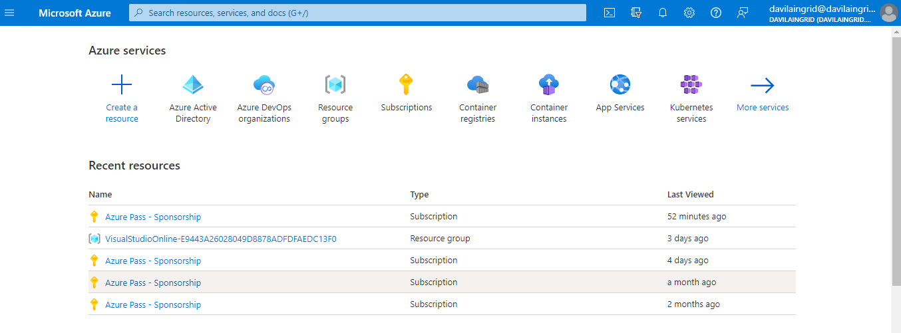
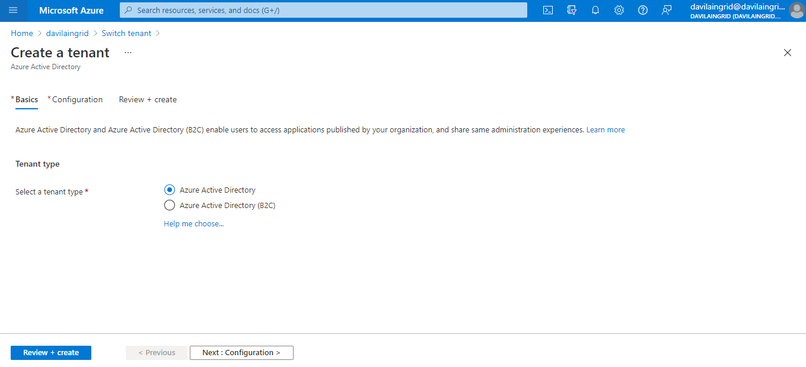

# Exercise 1: Registering an application in Azure Active Directory

## Task 1: Open the Azure portal

1. On the taskbar, select the **Microsoft Edge** icon.

1. In the open browser window, navigate to the **Azure portal** ([portal.azure.com](https://portal.azure.com/)).

1. Enter the **email address** for your Microsoft account.

1. Select **Next**.

1. Enter the **password** for your Microsoft account.

1. Select **Sign in**.

    

    **Note**:
    If this is your first time signing in to the Azure Portal, a dialog box will appear offering a tour of the portal. Select Get Started to begin using the portal. 

## Task 2: Create an Active Directory tenant

In this task, you will create a new Active Directory organization so you will understand the steps involved. Even though you will be creating a new Azure Active Directory organization, the remainder of the tasks will have you continue to work in the existing organization that was provided with your Azure portal.
### Create an Azure AD organization

1. Expand the left navigation pane, select **Azure Active Directory**.

1. Select **Create a tenant** located in the right side of the portal.

1. From the **Basics** tab, perform the following actions:

    1. In the **Select a tenant type** section, select **Azure Active Directory**.

    

    1. Select **Next: Configuration**.

    

1. From the **Configuration** tab, perform the following actions:

    1. **Organization name**: *Contoso Marketing Company*

    1. **Initial domain name**: *contosomarketingXXXX* where you replace *XXXX* with numbers or letters to make your domain name unique.

    1. Select the **Country or region**.

        

    1. Select **Review + create**.

1. Ensure settings are correct and validation passed.

    

1. Select **Create**.

1. A **Directory creation in progress, this will take a few minutes** message is displayed.

    1. When directory creation is complete, select **Click here to navigate to your new directory**.

## Task 3: Create a user in new Active Directory tenant

In this task, you will create a user in the new Active Directory tenant you just created in the previous steps. This user account will be used later in an exercise used for adding guest users to a single organization. 
1. From the Active Directory page (Contoso Marketing Company), select **Users**.

1. Select **New user**.

1. Ensure **Create user** is selected.

1. On the **New user** page, enter information for this user:

    - **User name:** testuser

    - **Name:** Test User

    - **First Name:** Test

    - **Last Name:** User

    - **Password:** Auto-generate passwordSelect **Show password**. Copy the autogenerated password provided in the Password box. You'll need to give this password to the user to sign in for the first time.

1. Select **Create**.

1. Launch a **New InPrivate Window** browser session.

1. Test new user in Azure portal and change password:

    1. Navigate to the Azure portal, [https://portal.azure.com](https://portal.azure.com/) in the InPrivate browser session.

    1. Sign in with your new *testuser@contosomarketingxx@onmicrosoft.com* account.

    1. You will be prompted to change the password. Paste the auto-generated password you copied and paste into the **Current password** field.

    1. Set the password as desired.

    1. Save the username and password so you will remember the credentials for using it later in this lab.

## Task 4: Register an application

In this task, you will switch Active Directory tenants and then continue with registering an application into the default 
### Switch Azure AD Directory

1. Select the Directory + subscription icon.

    

1. Select **Contoso**.

    

1. You should be redirected to the Active Directory page for Contoso. If it redirected you to the default Azure portal landing page, then follow the steps below to navigate back to Azure Active Directory:

    1. You will be redirected to the Azure portal landing page where you should now see an Azure Active Directory button available.

    1. Select the **Azure Active Directory** icon. If you do not have the icon: expand the left navigation pane, select **Azure Active Directory**.

### Register a new application

1. On the left menu, navigate to **App registrations**.

1. Select **New Registration**.

1. From the **Register an application** pane, perform the following actions:

    1. In the **Name** text box, enter the value **ContosoApp**.

    1. In the **Supported account type** section, select **Accounts in this organizational directory only**.

    1. Leave the **Redirect URI (optional)** as blank.

        

    1. Select **Register**. The application overview page is displayed.

## Task 5: Branding of the application

1. On the left menu, navigate to **Branding**.

1. Verify that you can personalize branding by providing a logo, home page URL, terms of service URL, and a privacy statement URL.

    

1. This exercise is now complete.

## Review

In this exercise, you learned how to create a new Active Directory organization, create a new user, switch directories, register and brand the application.

